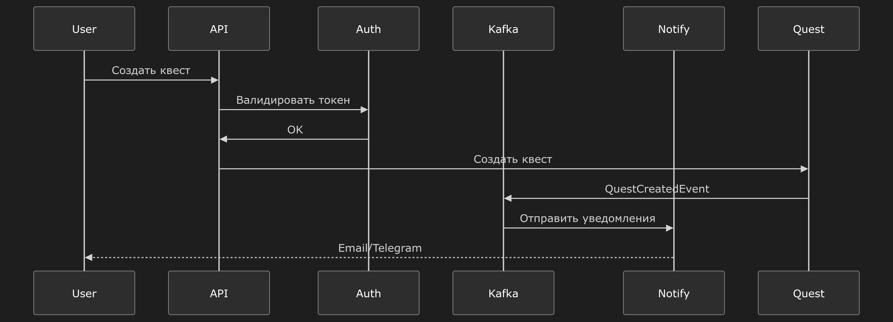

# 🎮 DN Quest — Платформа для командных онлайн-квестов

[](https://openjdk.org/)
[](https://spring.io/projects/spring-boot)
[](https://gradle.org/)
[](https://www.docker.com/)
[](https://www.postgresql.org/)
[](https://kafka.apache.org/)

> Современная микросервисная платформа для создания и прохождения **командных квестов** в реальном времени.
> Построена на Java 21, Spring Boot 3.2 и архитектуре событийного взаимодействия.

---

## 📦 Содержание

- [Быстрый старт](#-быстрый-старт)
- [Архитектура](#-архитектура)
- [Микросервисы](#-микросервисы)
- [Технологический стек](#-технологический-стек)
- [Запуск](#-запуск)
- [Зависимости сервисов](#-зависимости-сервисов)
- [Конфигурация](#-конфигурация)
- [Мониторинг](#-мониторинг)
- [Безопасность](#-безопасность)

---

## 🚀 Быстрый старт

### Предварительные требования

| Инструмент | Версия | Назначение |
|-------------|--------|------------|
| Docker | 24.0+ | Контейнеризация |
| Docker Compose | 2.20+ | Оркестрация сервисов |
| Java | 21 | Среда выполнения |
| Gradle | 8.5 | Сборка проекта |

### Запуск за 5 минут

```bash
# 1. Клонирование репозитория
git clone https://github.com/your-repo/dn-quest.git
cd dn-quest

# 2. Сборка проекта
make build

# 3. Запуск всех сервисов
make dev-up

# 4. Проверка статуса
make status
```

После запуска доступны:

| Сервис | URL | Учётные данные | Примечание |
|--------|-----|----------------|------------|
| Frontend | http://localhost:3000 | — | |
| API Gateway | http://localhost:8080 | admin / admin | |
| Swagger UI | http://localhost:8080/swagger-ui.html | admin / admin | |
| MinIO Console | http://localhost:9001 | minioadmin / minioadmin | |

**Дополнительные сервисы мониторинга (в разработке)** (в `docker/` директории):

| Сервис | URL | Учётные данные | Конфигурация |
|--------|-----|--------|------------|
| Grafana | http://localhost:3001 | admin / admin | `docker/grafana/` |
| Jaeger | http://localhost:16686 | — | `docker/jaeger/` |
| Prometheus | http://localhost:9090 | — | `docker/prometheus/` |

---

## 🏗️ Архитектура

### Высокоуровневая схема
```
graph TB
    Frontend["Frontend<br/>:3000"] --> Gateway["API Gateway<br/>:8080"]
    
    Gateway --> Auth["Auth Service<br/>:8081"]
    Gateway --> User["User Management<br/>:8082"]
    Gateway --> Quest["Quest Management<br/>:8083"]
    Gateway --> Game["Game Engine<br/>:8084"]
    Gateway --> Team["Team Management<br/>:8085"]
    Gateway --> Notify["Notification<br/>:8086"]
    Gateway --> Stats["Statistics<br/>:8087"]
    Gateway --> Files["File Storage<br/>:8088"]
    
    Kafka{"Apache Kafka<br/>:9092"} 
    Auth --> Kafka
    Quest --> Kafka
    Game --> Kafka
    Team --> Kafka
    Notify --> Kafka
    Stats --> Kafka
    
    PostgreSQL["PostgreSQL<br/>:5432"]
    Redis["Redis<br/>:6379"]
    MinIO["MinIO<br/>:9000"]

```
```
                                    ┌─────────────────┐
                                    │   Frontend      │
                                    │   (Vue.js)      │
                                    └────────┬────────┘
                                             │
                                    ┌────────▼────────┐
                                    │  API Gateway   │
                                    │  :8080        │
                                    ���────────┬────────┘
                                             │
           ┌─────────────────────────────────┼─────────────────────────────────┐
           │                                 │                                 │
    ┌──────▼──────┐                  ┌──────▼──────┐                  ┌──────▼──────┐
    │  Auth       │                  │  Game       │                  │  Quest      │
    │  Service   │                  │  Engine     │                  │  Management │
    │  :8081     │                  │  :8084     │                  │  :8083     │
    └──────┬──────┘                  └──────┬──────┘                  └──────┬──────┘
           │                                 │                                 │
    ┌──────▼──────┐                  ┌──────▼──────┐                  ┌──────▼──────┐
    │  User      │                  │  Team       │                  │  File      │
    │  Management│                  │  Management │                  │  Storage   │
    │  :8082     │                  │  :8085      │                  │  :8088     │
    └──────┬──────┘                  └──────┬──────┘                  └──────┬──────┘
           │                                 │                                 │
           └─────────────────────────────────┼─────────────────────────────────┘
                                             │
                                  ┌─────────▼──────────┐
                                  │  Notification     │
                                  │  :8086            │
                                  └─────────┬──────────┘
                                             │
                                  ┌─────────▼──────────┐
                                  │  Statistics       │
                                  │  :8087            │
                                  └─────────────────────┘
```

### Схема событийной шины

```
┌─────────────────────────────────────────────────────────────────────────────┐
│                        Apache Kafka                                        │
│                    (Событийная шина сообщений)                             │
├─────────────────────────────────────────────────────────────────────────────┤
│  Topics:                                                                   │
│  • dn-quest.users.events     — События пользователей                       │
│  • dn-quest.quests.events   — События квестов                             │
│  • dn-quest.game.events     — События игрового процесса                      │
│  • dn-quest.teams.events   — События к��манд                                │
│  • dn-quest.notifications  — Уведомления                                  │
└─────────────────────────────────────────────────────────────────────────────┘
```

---

## 📱 Микросервисы

### 1. API Gateway (порт: 8080)

[](https://spring.io/projects/spring-cloud-gateway)

**Описание:** Единая точка входа для всех микросервисов. Обеспечивает маршрутизацию запросов, JWT-аутентификацию и rate limiting.

**Функции:**
- Маршрутизация запросов к соответствующим сервисам
- JWT-валидация и генерация токенов
- Rate limiting на основе Redis
- Circuit breaker для отказоустойчивости
- CORS конфигурация
- Логирование и трассировка

**Эндпоинты:**
```
/api/auth/**          → Authentication Service (:8081, /api/auth)
/api/users/**        → User Management Service (:8082, /api/users)
/api/quests/**      → Quest Management Service (:8083, /api/quests)
/api/game/**       → Game Engine Service (:8084, /api/game)
/api/teams/**      → Team Management Service (:8085, /api)
/api/notifications → Notification Service (:8086, /api/notifications)
/api/statistics/** → Statistics Service (:8087, /api/stats)
/api/files/**      → File Storage Service (:8088, /api/files)
```

### 2. Authentication Service (порт: 8081, context-path: /api/auth)

**Описание:** Сервис аутентификации и авторизации. Управляет регистрацией, входом и JWT-токенами.

**Основные возможности:**
- Регистрация пользователей
- Вход по логину/паролю
- Генерация и валидация JWT токенов (access + refresh)
- Сброс пароля
- Управление разрешениями (permissions)
- Интеграция с Kafka для событий пользователей

**База данных:** PostgreSQL (схема `auth`)

**Топики Kafka:**
- `dn-quest.users.events` — События пользователей

### 3. User Management Service (порт: 8082, context-path: /api/users)

**Описание:** Управление профилями пользователей и их данными.

**Основные возможности:**
- CRUD операции с профилями пользователей
- Обновление аватара и персональных данных
- Поиск пользователей
- История активности

**База данных:** PostgreSQL (схема `users`)

### 4. Quest Management Service (порт: 8083, context-path: /api/quests)

**Описание:** Создание и управление квестами.

**Основные возможности:**
- Создание и редактирование квестов
- Управление уровнями и заданиями
- Публикация и архивирование квестов
- Загрузка медиафайлов (через File Storage Service)
- Генерация QR-кодов для заданий

**База данных:** PostgreSQL (схема `quests`)

### 5. Game Engine Service (порт: 8084, context-path: /api/game)

**Описание:** Игровая логика и обработка кодов участников.

**Основные возможности:**
- Управление игровыми сессиями
- Обработка скан-кодов (QR-коды, NFC)
- Валидация ответов на задания
- Подсчёт очков и времени
- Лидерборды в реальном времени
- Интеграция с Redis для ��эширования

**База данных:** PostgreSQL (схема `game`)

### 6. Team Management Service (порт: 8085, context-path: /api)

**Описание:** Управление командами участников.

**Основные возможности:**
- Создание и управление командами
- Приглашение участников
- Управление ролями в команде (лидер, участник)
- Чат команды
- Командные статистики

**База данных:** PostgreSQL (схема `teams`)

### 7. Notification Service (порт: 8086, context-path: /api/notifications)

**Описание:** Сервис уведомлений через различные каналы.

**Основные возможности:**
- Email уведомления (SMTP)
- Telegram бот уведомления
- In-app уведомления
- Шаблонизация сообщений
- Очередь отправки через Kafka

**База данных:** PostgreSQL (схема `notifications`)

**Каналы:**
- 📧 Email (SMTP)
- 📱 Telegram Bot
- 🔔 In-App

### 8. Statistics Service (порт: 8087, context-path: /api/stats)

**Описание:** Сбор и анализ статистики игрового процесса.

**Основные возможности:**
- Статистика прохождения квестов
- Командные рейтинги
- Аналитика активности
- Экспорт отчётов
- Интеграция с Elasticsearch

**База данных:** PostgreSQL (схема `statistics`)

### 9. File Storage Service (порт: 8088, context-path: /api/files)

**Описание:** Хранение файлов в MinIO (S3-совместимое хранилище).

**Основные возможности:**
- Загрузка файлов
- Генерация превью для изображений
- Управление файлами квестов
- Интеграция с MinIO

**Хранилище:** MinIO

---

## 🛠 Технологический стек

### Backend

| Технология | Версия | Назначение |
|-------------|--------|------------|
| Java | 21 | Язык программирования |
| Kotlin | 1.9.20 | Дополнительный язык |
| Spring Boot | 3.2.0 | Фреймворк |
| Spring Cloud | 4.1.x | Облачные компоненты |
| Spring Data JPA | 3.2.x | ORM |
| PostgreSQL | 16 | Основная БД |
| Redis | 7 | Кэширование, сессии |
| Apache Kafka | 7.5.0 | Событийная шина |
| MinIO | latest | S3 хранилище |

### Frontend

| Технология | Версия | Назначение |
|-------------|--------|------------|
| Vue.js | 3.x | Фреймворк |
| Vite | 5.x | Сборщик |
| Axios | ^1.6 | HTTP клиент |
| TailwindCSS | 3.x | Стилизация |

### Инфраструктура и мониторинг

| Технология | Версия | Назначение |
|-------------|--------|------------|
| Docker | 24+ | Контейнеризация |
| Docker Compose | 2.20+ | Оркестрация |
| Grafana | 10.x | Мониторинг |
| Prometheus | 2.x | Метрики |
| Jaeger | 1.x | Трассировка |
| Elasticsearch | 8.x | Логи |
| Logstash | 8.x | Сбор логов |
| Kibana | 8.x | Визуализация логов |

---

## ▶️ Запуск

### Команды Makefile

```bash
# =============================================
# Сборка
# =============================================

make build               # Полная пересборка всех сервисов
make build-service      # Пересобрать один сервис
make test               # Запустить все тесты
make check              # Проверка качества кода

# =============================================
# Docker Compose
# =============================================

make dev-up             # Запустить все микросервисы
make dev-infra          # Запустить только инфраструктуру
make dev-all           # Запустить инфраструктуру + все сервисы
make dev-down          # Остановить и удалить контейнеры
make dev-restart       # Полный перезапуск

# =============================================
# Управление сервисами
# =============================================

make logs SERVICE=xxx  # Логи сервиса
make status           # Статус всех контейнеров
make stats            # Использование ресурсов

# =============================================
# Консоли
# =============================================

make minio-console     # Открыть MinIO Console
make swagger         # Открыть Swagger UI
make pgadmin         # Открыть pgAdmin
```

### Ручной запуск

```bash
# Запуск инфраструктуры
docker compose -f docker-compose.dev.yml up -d postgres-dev redis-dev zookeeper-dev kafka-dev minio-dev

# Запуск микросервисов
docker compose -f docker-compose.dev.yml up -d --build

# Остановка
docker compose -f docker-compose.dev.yml down -v --remove-orphans
```

---

## 🔗 Зависимости сервисов

### Диаграмма зависимостей

```
┌─────────────────────────────────────────────────────────────────────────────┐
│                           ИНФРАСТРУКТУРА                                   │
│    PostgreSQL ─── Redis ─── Kafka ─── MinIO                               │
└────────────���─���──────────────────────────────────────────────────────────────┘
                                    │
                                    ▼
┌─────────────────────────────────────────────────────────────────────────────┐
│                    .authentication-service                                    │
│              (Аутентификация, JWT токены)                                 │
│                        :8081                                              │
└─────────────────────────────────────────────────────────────────────────────┘
           │                                             │
           ▼                                             ▼
┌─────────────────────────────┐         ┌─────────────────────────────────┐
│  user-management-service   │         │       file-storage-service     │
│     Управление профилями   │         │        Хранение файлов        │
│           :8082            │         │            :8088                │
└─────────────────────────────┘         └─────────────────────────────────┘
           │                                             │
           ▼                                             ▼
┌─────────────────────────────┐         ┌─────────────────────────────────┐
│  quest-management-service  │         │    team-management-service     │
│      Управление квестами   │         │      Управление командами     │
│           :8083            │         │            :8085                │
└─────────────────────────────┘         └─────────────────────────────────┘
           │                                             │
           ▼                                             ▼
┌─────────────────────────────────────────────────────────────────────────────┐
│                        game-engine-service                                 │
│                   Игровая логика, обработка кодов                        │
│                              :8084                                        │
└─────────────────────────────────────────────────────────────────────────────┘
           │                              │                              │
           ▼                              ▼                              ▼
┌─────────────────────────────┐ ┌─────────────────────────────┐ ┌──────────────┐
│  notification-service      │ │  statistics-service       │ │  API Gateway│
│     Уведомления           │ │     Статистика            │ │   :8080     │
│         :8086             │ │         :8087             │ └──────────────┘
└─────────────────────────────┘ └─────────────────────────────┘
```

### Kafka




### Порядок запуска

1. **Инфраструктура:** PostgreSQL → Redis → Kafka → MinIO
2. **Authentication Service** (базовый сервис)
3. **User Management Service** → **File Storage Service**
4. **Quest Management Service** → **Team Management Service**
5. **Game Engine Service** (зависит от Quest + Team)
6. **Notification Service** → **Statistics Service**
7. **API Gateway** (точка входа)

---

## ⚙️ Конфигурация

### Переменные окружения

| Переменная | Описание | Значение по умолчанию |
|------------|----------|----------------------|
| `POSTGRES_PASSWORD` | Пароль PostgreSQL | dn |
| `REDIS_HOST` | Хост Redis | localhost |
| `KAFKA_BOOTSTRAP_SERVERS` | Kafka серверы | kafka-dev:29092 |
| `MINIO_ACCESS_KEY` | MinIO ключ | minioadmin |
| `MINIO_SECRET_KEY` | MinIO секрет | minioadmin |
| `JWT_SECRET` | Секрет JWT | ... |
| `JWT_EXPIRATION` | Срок жизни JWT (мс) | 86400000 |

### Настройка .env файла

```bash
# Копировать и настроить
cp .env .env.local

# Отредактировать
nano .env.local
```

### Профили Spring

| Профиль | Назначение |
|---------|----------|
| `dev` | Локальная разработка |
| `test` | Тестирование |
| `prod` | Production |

---

## 📊 Мониторинг

> **Примечание:** Сервисы мониторинга (Grafana, Jaeger, Elasticsearch, Kibana) находятся в директории `docker/` и могут требовать отдельного запуска.

### Доступные дашборды

| Инструмент | URL | Описание | Конфигурация |
|------------|-----|-----------|-------------|
| Grafana | http://localhost:3001 | Метрики и дашборды | `docker/grafana/` |
| Jaeger | http://localhost:16686 | Распределённая трассировка | `docker/jaeger/` |
| Prometheus | http://localhost:9090 | Сбор метрик | `docker/prometheus/` |
| Elasticsearch | http://localhost:9200 | Поиск логов | `docker/elasticsearch/` |
| Kibana | http://localhost:5601 | Визуализация логов | `docker/kibana/` |

### Метрики

- **API Gateway:** Rate limiting, количество запросов, время отклика
- **Authentication:** Входы, регистрации, ошибки аутентификации
- **Game Engine:** Активные сессии, количество игроков
- **Database:** Запросы, время выполнения, соединения

---

## 🔒 Безопасность

### Checklist для Production

- [ ] Изменить все пароли по умолчанию
- [ ] Настроить HTTPS (SSL/TLS сертификаты)
- [ ] Сменить `JWT_SECRET` на безопасное значение
- [ ] Настроить firewall (открыть только необходимые порты)
- [ ] Включить мониторинг и алерты
- [ ] Настроить резервное копирование БД
- [ ] Провести нагрузочное тестирование
- [ ] Настроить логирование аудита

### Порты для firewall

```
80, 443   - HTTP/HTTPS
3000       - Frontend
8080       - API Gateway
5432       - PostgreSQL
6379       - Redis
9092       - Kafka
```

---

## 📚 Документация

- [Руководство по Docker](docs/docker-configuration-guide.md)
- [Архитектура микросервисов](docs/microservices-architecture.md)
- [Интеграци�� Kafka](docs/kafka-integration.md)
- [Мониторинг и метрики](docs/monitoring-guide.md)
- [Тестирование](docs/testing-guide.md)

---

## 🤝 Лицензия

MIT License

---

## 👨‍💻 Авторы

Denis Neverov